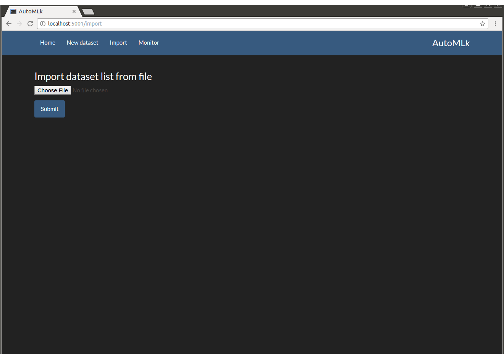
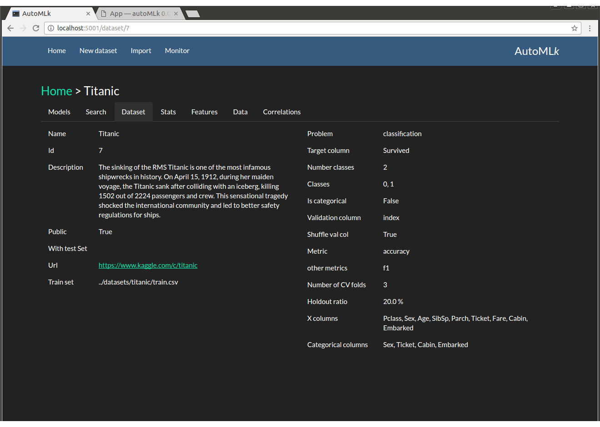
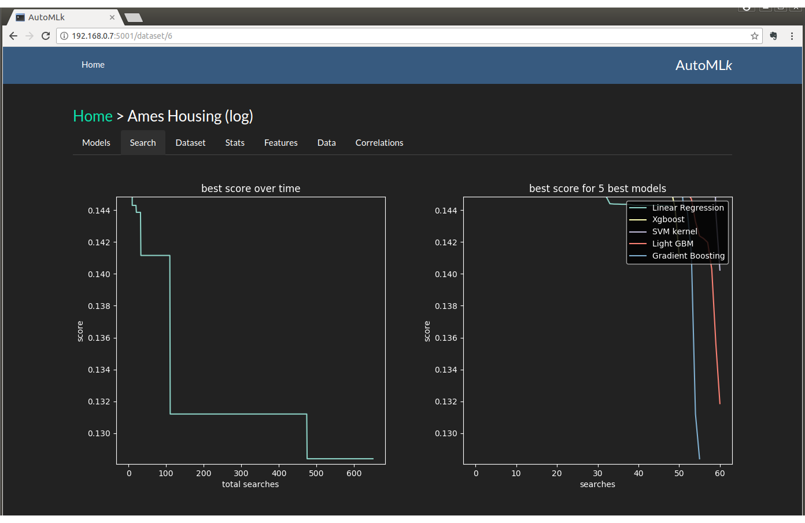
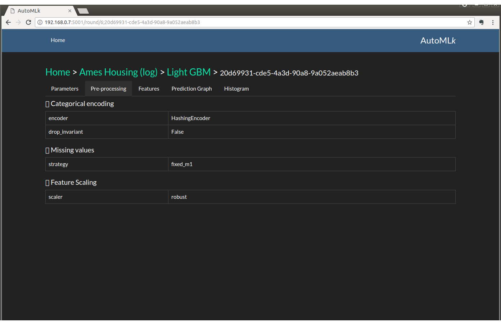
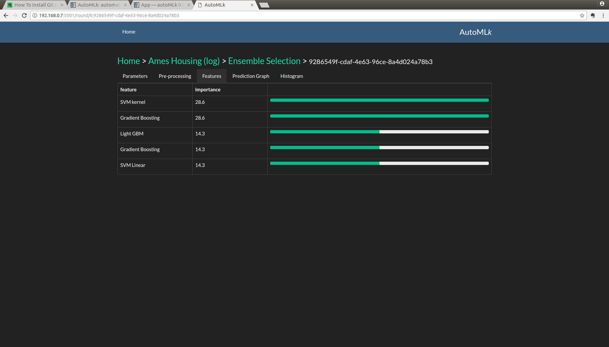

App
===

The dataset and the results of the search are best viewed with the web app through a standard browers.

to start the app, please go in the automlk-app folder and run the app server:

.. code-block:: python

    python run.py

then access the app in a browser with the follwoing url:

.. code-block:: python

    http://localhost:5001

or from another machine with the ip address of the machine where the server is running:

.. code-block:: python

    http://192.168.0.10:5001

(in this example, we suppose the address of the server is 192.168.0.10)

User guide
==========

Home
----

The home page shows the list of datasets:

.. figure:: img/home.png
   :scale: 70 %
   :alt: home page

   list of datasets in autoMLk

Dataset
-------

To import the list of datasets (or a new list):

   import a list of datasets

You may create directly a dataset by using the 'New Dataset' option in the menu:

.. figure:: img/create_dataset.png
   :scale: 70 %
   :alt: create dataset

   create a new dataset

We can access to a specific dataset in clicking on the row of the required dataset.
When a dataset is created, there is only the features and analysis of the data available:

   parameters of the dataset

By clicking on the various tabs, we can view:

.. figure:: img/features.png
   :scale: 70 %
   :alt: features

   the list of features of the dataset

.. figure:: img/hist.png
   :scale: 70 %
   :alt: histogram of the target column

   the histogram of the target column

.. figure:: img/correl.png
   :scale: 70 %
   :alt: correlation matrix of the features

   the correlation matrix of the features

We need to launch the search process with various models in order to access to be results

Results and best models
-----------------------

When the search is launched, 2 additional tabs are available:

.. figure:: img/best.png
   :scale: 70 %
   :alt: models with the best scores

   Best models by eval score

   The evolution of the best scores in time

And then by clicking on a specific model access to the details

.. figure:: img/model.png
   :scale: 70 %
   :alt: details of the search by model

   details of the search by model

And then on a specific round:

.. figure:: img/round.png
   :scale: 70 %
   :alt: details of a round

   a round with a se of model parameters and pre-processing

   details of the re-processing steps

Where we can view the performance and the predictions:

.. figure:: img/importance.png
   :scale: 70 %
   :alt: feature importance

   feature importance scored by the model

.. figure:: img/predict.png
   :scale: 70 %
   :alt: predictions versus actuals

   predictions versus actuals (in regression)

.. figure:: img/confusion.png
   :scale: 70 %
   :alt: confusion matrix

   and a confusion matrix (in classification)

.. figure:: img/histpred.png
   :scale: 70 %
   :alt: histogram of the predictions

   and the histogram of the predictions

Ensembles
---------

After launching the search in 'ensemble' mode, another tab 'Ensembles' is available at dataset level.
We can view the performance of the various ensemble models, and the models used as a 1st level:

.. figure:: img/ensembles.png
   :scale: 70 %
   :alt: ensembles models

   performance of the ensemble models

   feature importance for an ensemble model

Monitoring
----------

The monitoring screen displays the different status of the different components in the architecture: controller and workers

.. figure:: img/monitor.png
   :scale: 70 %
   :alt: monitoring

   monitoring panel
