User guide
==========

The dataset and the results of the search are best viewed with the web app through a standard browers.

to start the app, please go in the web folder and run the app server:

.. code-block:: python

    python run.py

then access the app in a browser with the follwoing url:

.. code-block:: python

    http://localhost:5001

or from another machine with the ip address of the machine where the server is running:

.. code-block:: python

    http://192.168.0.10:5001

(in this example, we suppose the address of the server is 192.168.0.10)

Home
----

The home page shows the list of datasets:

.. figure:: img/home.png
   :scale: 70 %
   :alt: home page

   list of datasets in autoMLk

You can select a list of datasets from a specific domain, with the selector at the top right:

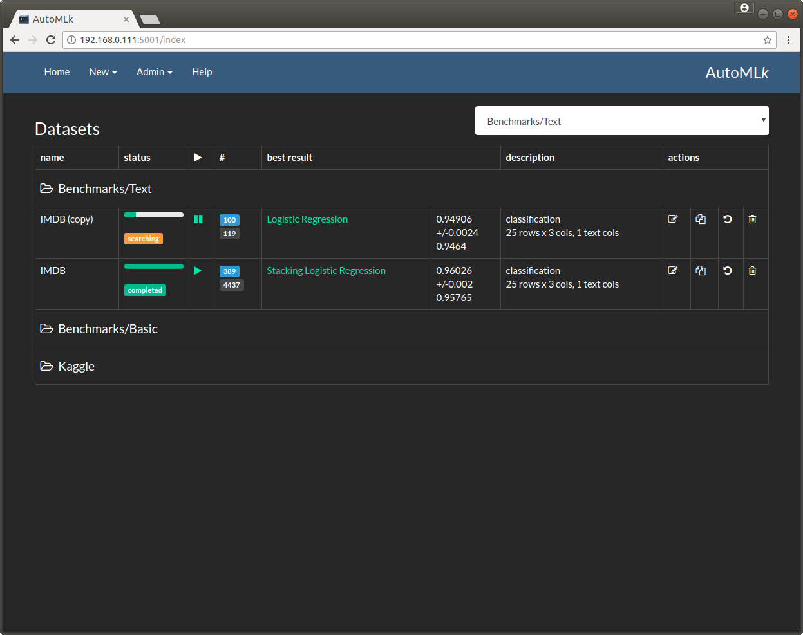

   list of datasets per domain

Dataset
-------

To import the list of preloaded datasets (or your own list), you can select the option 'Import' in the menu 'New':

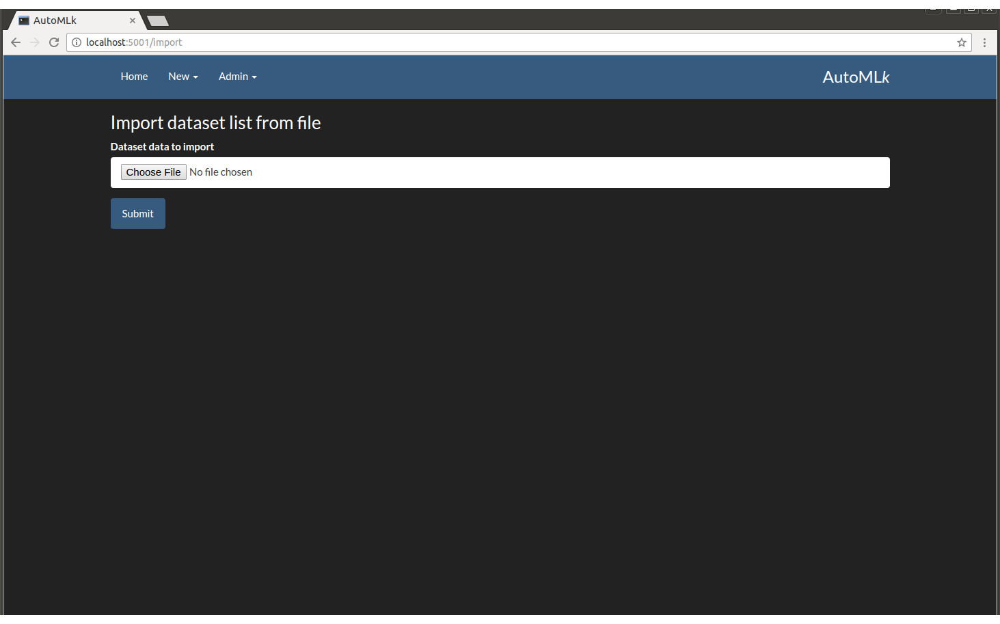

   import a list of datasets

You may create directly a dataset by using the 'Dataset' option in the menu 'New':

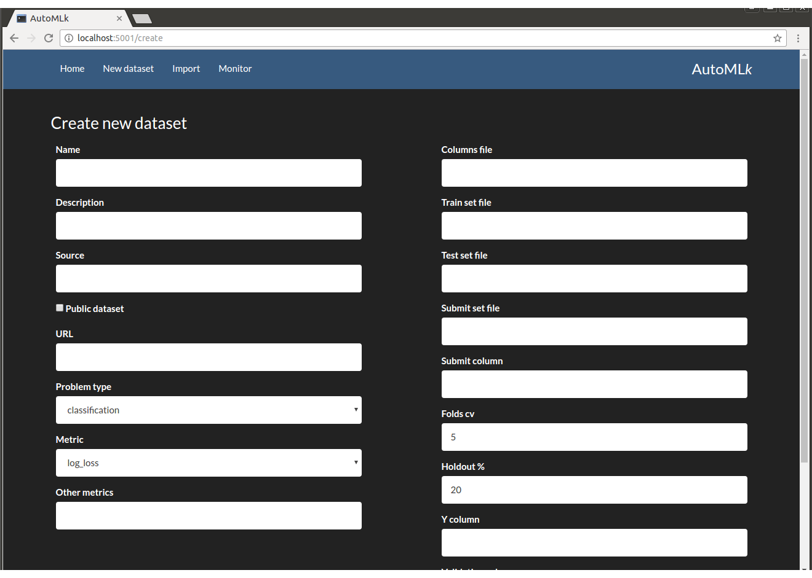

   create a new dataset

You may afterwards update *some fields* of a dataset by using the edit icon in the list of datasets in the home page:

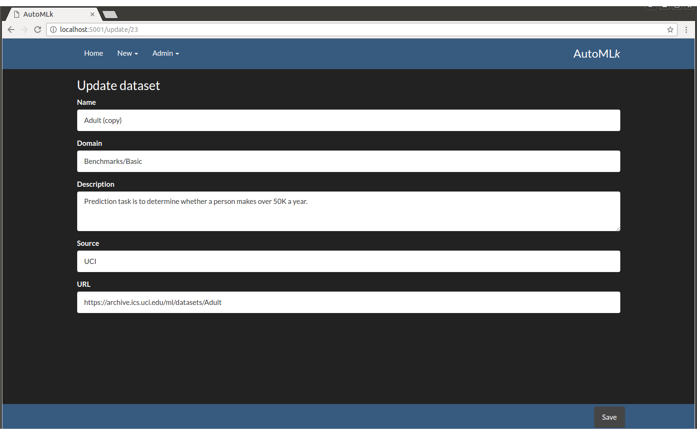

   update a dataset

We can access to a specific dataset in clicking on the row of the required dataset.
When a dataset is created, there is only the features and analysis of the data available:

.. figure:: img/info.png
   :scale: 70 %
   :alt: dataset

   parameters of the dataset

By clicking on the various tabs, we can view:

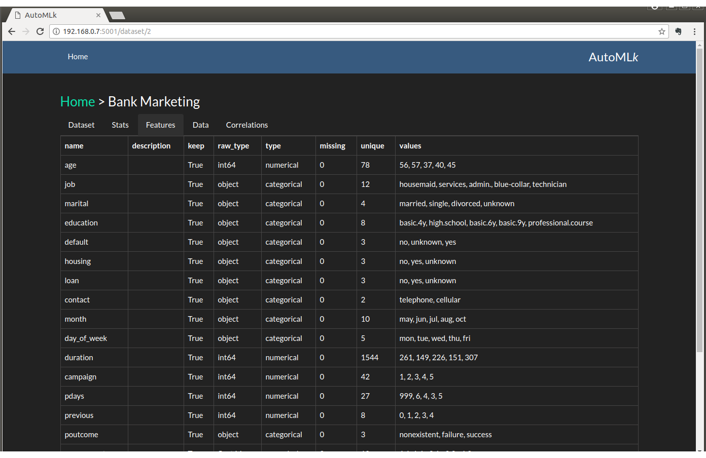

   the list of features of the dataset

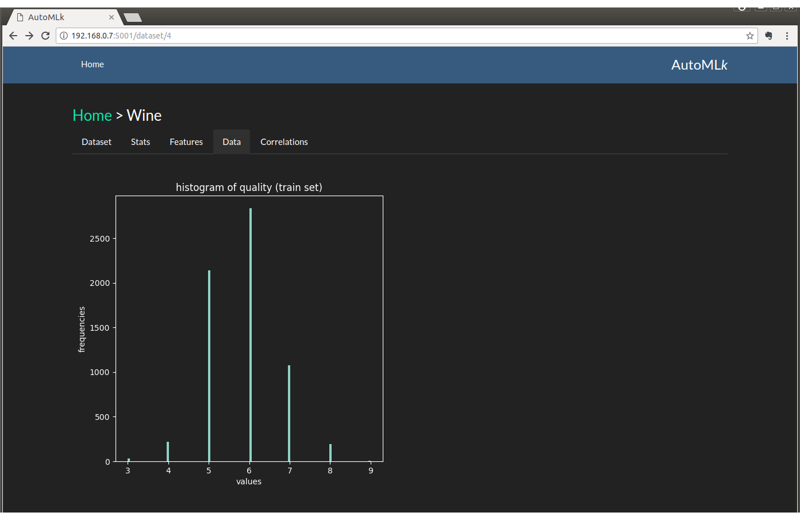

   the histogram of the target column

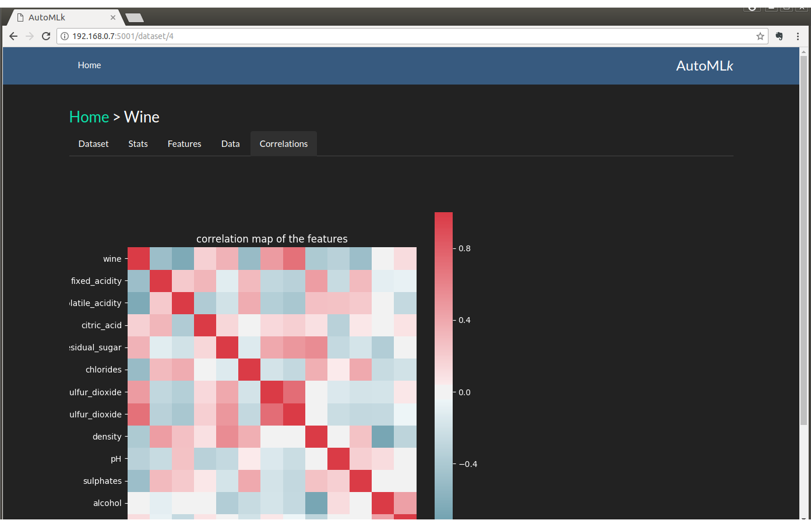

   the correlation matrix of the features

We need to launch the search process with various models in order to access to be results

Results and best models
-----------------------

When the search is launched, 3 additional tabs are available:

.. figure:: img/models.png
   :scale: 70 %
   :alt: models with the best scores

   Best models by eval score

And per pre-processing steps:

.. figure:: img/processes.png
   :scale: 70 %
   :alt: pre-processing steps with the best scores

   pre-processing steps by eval score

The graph of the best results over time:

.. figure:: img/best.png
   :scale: 70 %
   :alt: search history

   The evolution of the best scores in time

And after a while, the best ensembles:

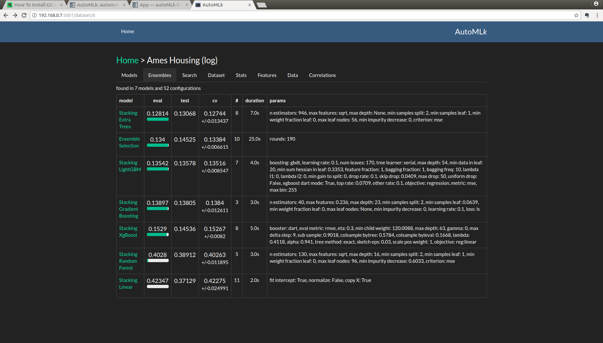

The best ensembles

And then by clicking on a specific model access to the details

.. figure:: img/list_model.png
   :scale: 70 %
   :alt: details of the search by model

   details of the search by model

And then on a specific round:

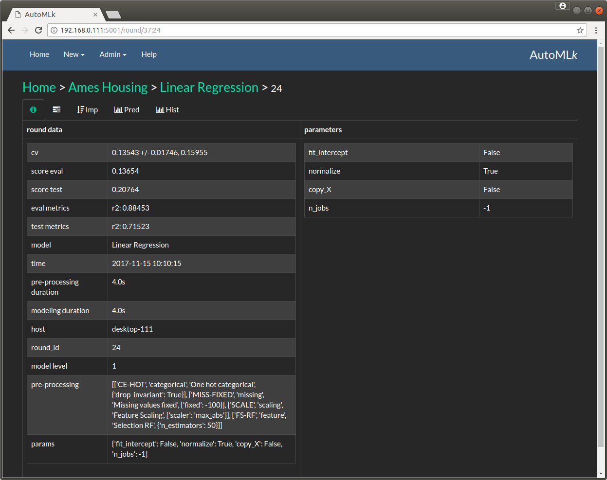

   a round with a se of model parameters and pre-processing

.. figure:: img/steps.png
   :scale: 70 %
   :alt: pre-processing steps

   details of the re-processing steps

Where we can view the performance and the predictions:

.. figure:: img/importance.png
   :scale: 70 %
   :alt: feature importance

   feature importance scored by the model

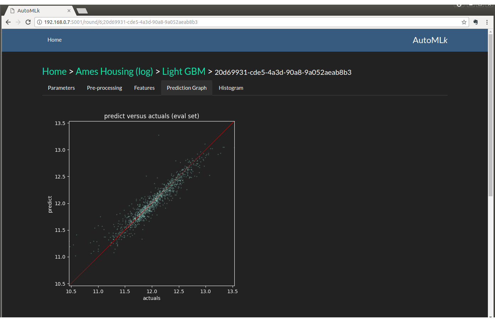

   predictions versus actuals (in regression)

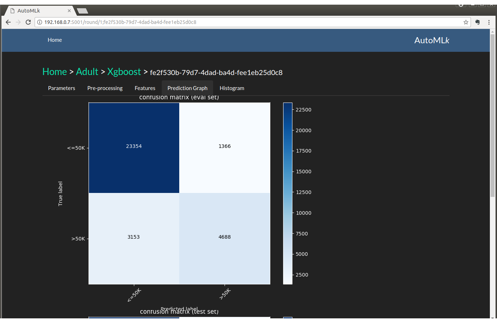

   and a confusion matrix (in classification)

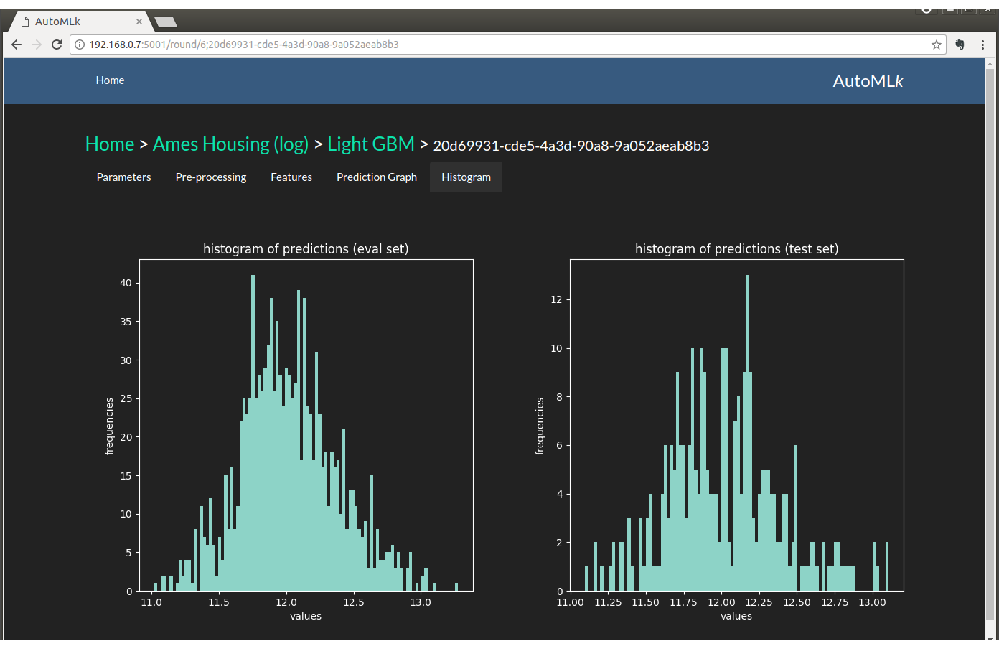

   and the histogram of the predictions

Admin
_____

Monitoring
__________

The monitoring screen displays the different status of the different components in the architecture: controller and workers

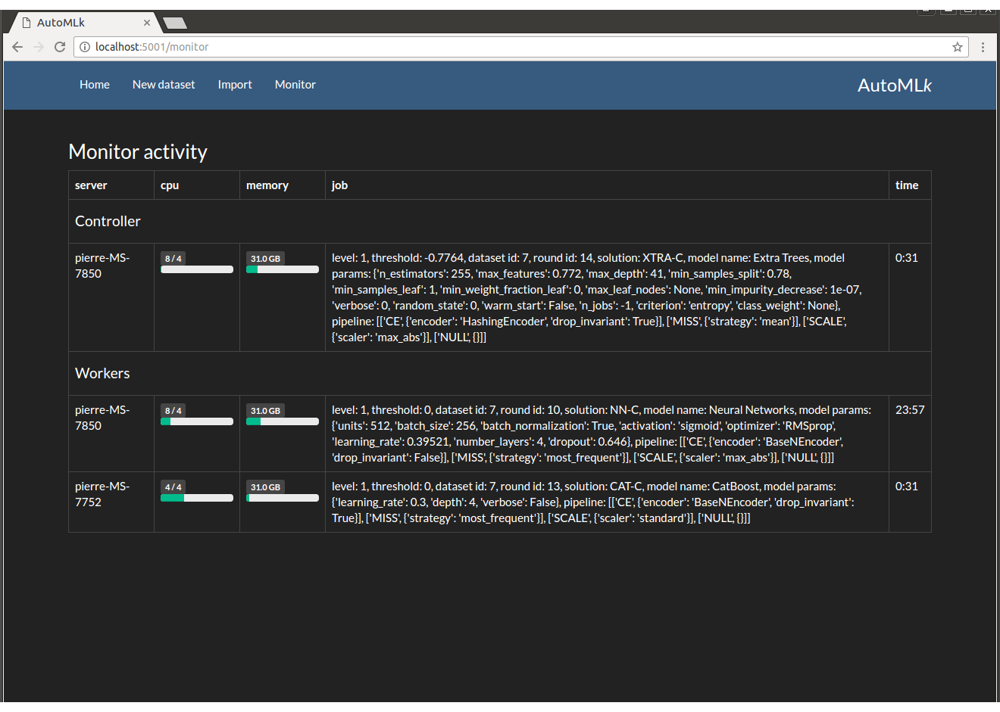

   monitoring panel

Config
______

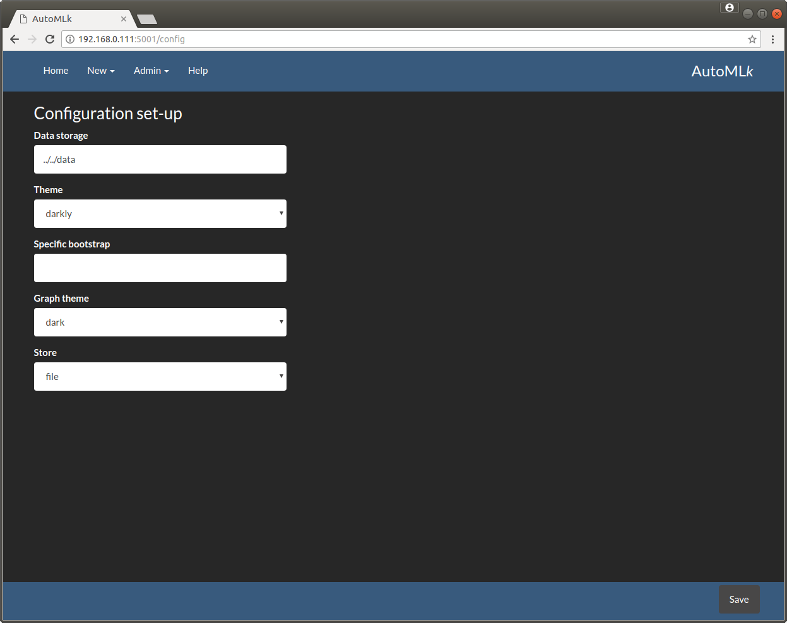

   configuration panel

It is also possible to modify the theme of the user interface directly from the config panel:

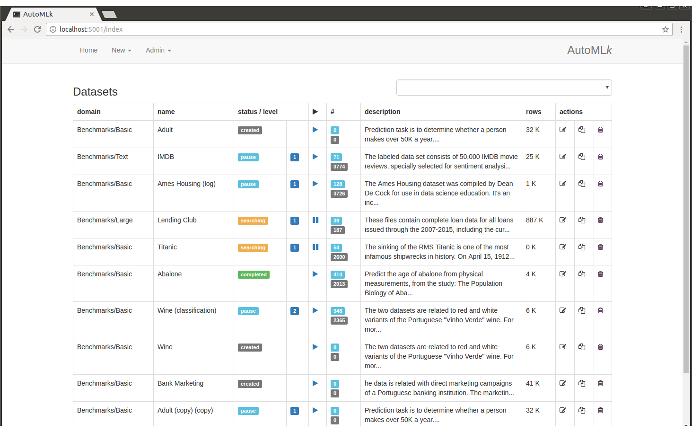

   configuration panel
