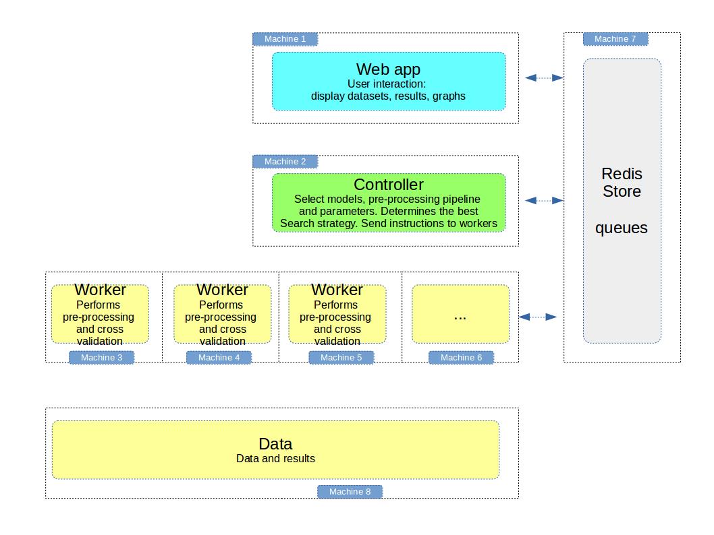
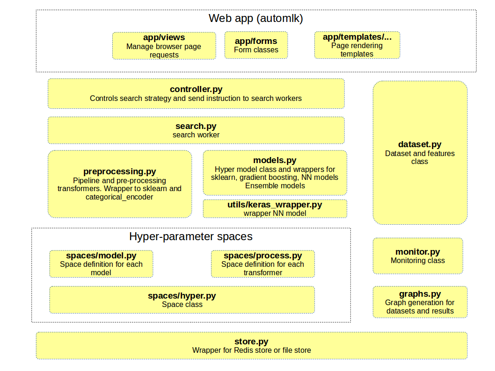

Architecture
============

The architecture is distributed and can be installed on multiple machines

* the web app for user interaction and display results
* the controller manages the search between models and parameters
* the grapher generates graphs on a dataset asynchronously
* the texter generates unsupervised models for text sets
* the workers execute the pre-processing steps and cross validation (cpu intensive): the more workers are run in parallel, the quicker the results
* the Redis store is an in-memory database and queue manager

   independent components of the architecture

The software architecture is organized in concentric layers:

   software components of the architecture

