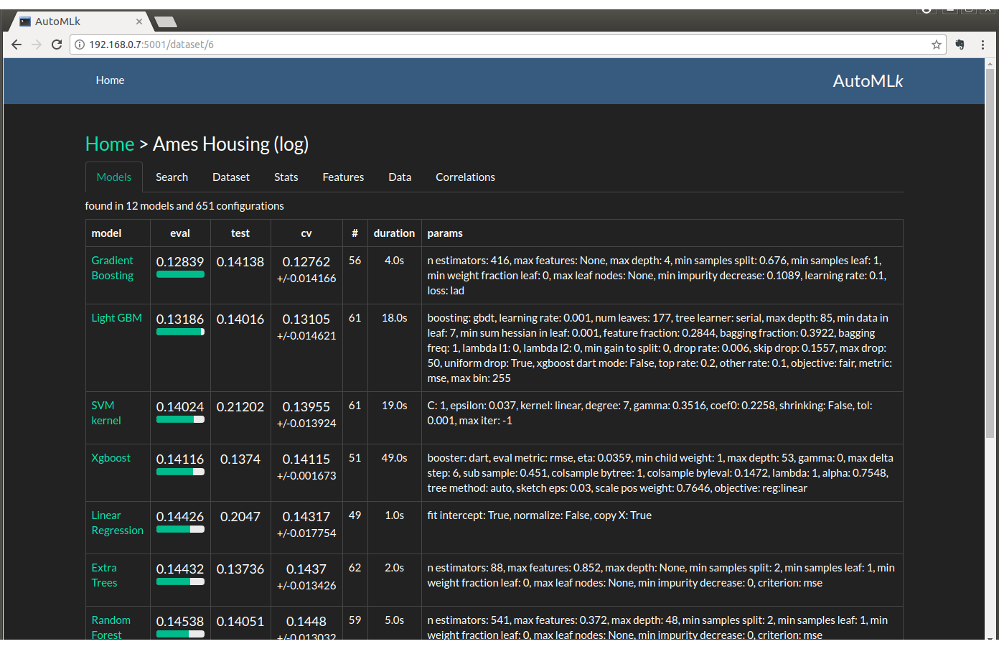

..  autoMLk documentation master file, created by
    sphinx-quickstart on Sun Sep  3 19:15:35 2017.

AutoMLk: automated machine learning toolkit
===========================================

This toolkit is designed to be integrated within a python project, but also independently through the interface of the app.

The framework is built with principles from auto-sklearn, with the following improvements:

* web interface (flask) to review the datasets, the search results and graphs
* include sklearn models, but also Xgboost, LightGBM, CatBoost and keras Neural Networks
* 2nd level ensembling with model selection and stacking
* can be used in competition mode (to generate a submit file from a test set), on benchmark mode (separate train set and public set) and standard mode.

   Best models by eval score

We have provided some public datasets to initialize the framework and compare results with best scores.

Content
-------

.. toctree::
    :maxdepth: 3

    app
    install
    architecture
    dataset
    searching
    models
    pre_processing

Indices
-------

* :ref:`genindex`
